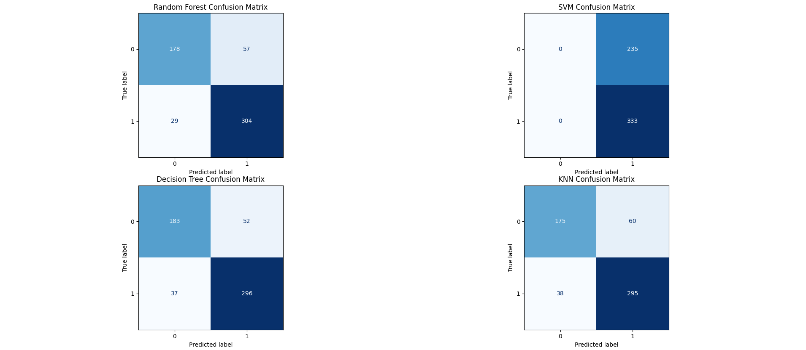
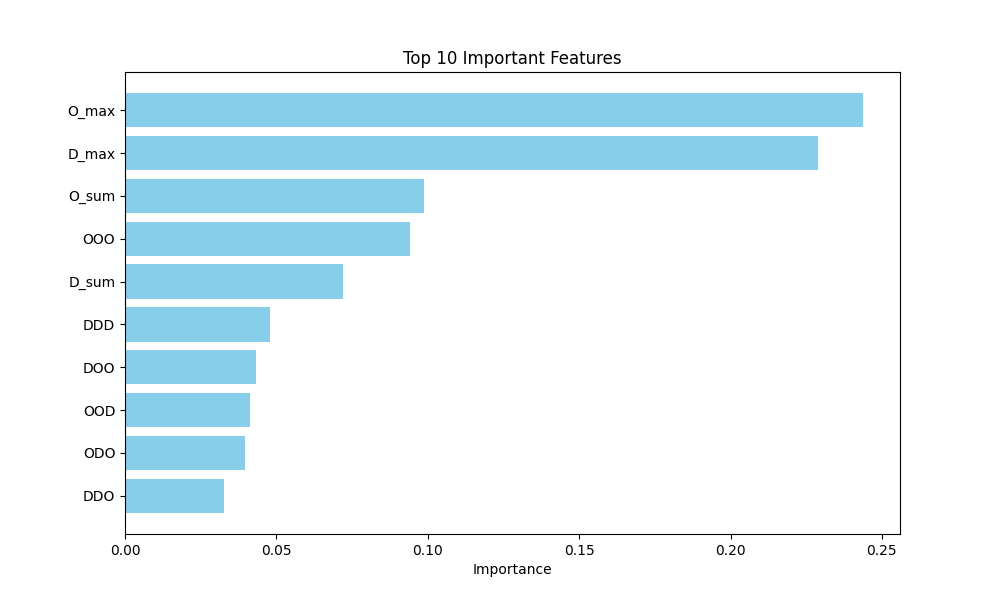

# Ransomware Detection for Linux-Based Systems Using Machine Learning

A behavior-based ransomware detection research project for Linux systems using eBPF-based system activity monitoring, n-gram behavioral features, and machine learning.

## Overview

Ransomware can exhibit distinctive behavioral patterns while interacting with files and system resources. This project investigates whether these behavioral patterns can be used to distinguish ransomware activity from benign system activity.

The project combines:

- eBPF/BCC-based system activity monitoring
- System-call and filesystem event collection
- Data cleaning and normalization
- Three-event n-gram (triplet) feature extraction
- Behavioral feature aggregation
- Machine learning classification
- Comparative evaluation of multiple ML models

The project was developed as an academic cybersecurity research project and focuses on behavior-based detection rather than signature-based detection.

---

## Research Framework

The overall research process follows the following framework:


The implementation focuses primarily on the data collection, preprocessing, feature engineering, model training, evaluation, and testing stages.

---

## Experimental Design

The project consists of two experimental stages.

### Part 1 — Existing Dataset

The first experimental stage used the dataset associated with the eBPFAngel research project.

The purpose of this stage was to investigate ransomware behavioral patterns using an existing dataset and to train and evaluate machine learning models using the behavioral feature representation adopted in this project.

The project uses a related n-gram/triplet-based representation of system activity.

The original eBPFAngel project is acknowledged in:

`references/ebpfangel.md`

The original dataset is not redistributed in this repository.

---

### Part 2 — Controlled Dataset

The second experimental stage used a newly collected dataset generated from controlled executions of ZeroLocker ransomware and benign activity.

Unlike the first stage, the data collection, cleaning, feature extraction, and dataset construction for this stage were performed as part of this project.

The same general behavioral feature representation and machine learning models were then applied to the newly constructed dataset.

### Final dataset

The final dataset contains:

| Class | Samples |
|---|---:|
| Benign | 1,171 |
| Malicious | 1,665 |
| **Total** | **2,836** |

The final processed dataset is provided in:

data/final_dataset_shuffled.csv


---

## Data Collection

### eBPF-based monitoring

The project uses eBPF through BCC to monitor system activity in a Linux environment.

The monitoring program attaches to the Linux `raw_syscalls/sys_enter` tracepoint and records selected system-call activity associated with filesystem and process behavior.

The monitoring stage records information including:

- Timestamp
- Process ID
- Process name
- System call
- Open activity
- Create activity
- Delete activity
- Process creation indicators
- Suspicious-process indicator

The monitoring implementation is located in:

src/zerolocker_monitor.py


### Controlled ransomware execution

The ZeroLocker experiments were conducted in a controlled Linux/Kali environment.

The Windows ransomware sample was executed using Wine while the eBPF-based monitor collected its runtime activity.

The ransomware sample itself is **not included in this repository**.

The raw execution logs are also not distributed through this repository.

---

## Benign Activity Collection

Benign system activity was generated separately to provide normal behavioral examples for comparison with ransomware activity.

The repository contains the benign activity-generation scripts:

src/benign_behavior_generator.py
src/benign_behavior_simulation.py


These scripts simulate ordinary file and system activity such as:

- Creating files
- Reading files
- Writing files
- Directory operations
- File manipulation
- Normal system commands
- Other ordinary user/system activity

The benign activity was monitored using the same general monitoring approach used for the ransomware experiments.

---

## Data Preprocessing

The raw monitoring output was processed before machine learning.

The preprocessing stage included:

1. Cleaning the captured event logs
2. Removing incomplete or unusable entries
3. Normalizing the event representation
4. Structuring the events into a consistent format
5. Converting event sequences into behavioral triplets
6. Aggregating the resulting behavioral features

Raw and intermediate execution logs are not included in the public repository.

This keeps the repository focused on the reproducible machine-learning dataset while avoiding unnecessary exposure of system-specific execution information.

---

## Feature Engineering

The project represents filesystem activity using three basic event types:

O = Open, 
C = Create, 
D = Delete

Sequences of three events are represented as triplets (three-event n-grams).

There are 27 possible combinations:

OOO  OOC  OOD
OCO  OCC  OCD
ODO  ODC  ODD

COO  COC  COD
CCO  CCC  CCD
CDO  CDC  CDD

DOO  DOC  DOD
DCO  DCC  DCD
DDO  DDC  DDD


The frequency of these patterns is used to represent behavioral characteristics of the monitored process.

### Aggregate features

The feature set also contains aggregate activity measures:


O_sum, 
C_sum, 
D_sum

O_max, 
C_max, 
D_max


`total_triplets` is also present in the processed dataset but is excluded from the final model input in the training script.

`PID` is retained in the dataset as metadata but is removed before model training.

---

## Machine Learning Models

Four supervised machine learning models are trained and evaluated:

### Random Forest

An ensemble classifier consisting of multiple decision trees.

### Support Vector Machine (SVM)

A classifier that separates classes using a learned decision boundary.

### Decision Tree

A tree-based classifier that recursively partitions the feature space.

### K-Nearest Neighbors (KNN)

A distance-based classifier that predicts the class of a sample using neighboring training samples.

The training and evaluation implementation is:

src/train_and_evaluate.py


---

## Training and Testing

The final dataset is divided into training and testing subsets using an 80/20 split:

80% → Training, 
20% → Testing


The split uses:

random_state = 42


and shuffling is enabled.

Before training:

- `PID` is removed because it is an identifier rather than a behavioral feature.
- `total_triplets` is removed from the model input.
- `LABEL` is separated as the target variable.

The remaining behavioral features are used as the model input.

---

## Evaluation

The models are evaluated using:

- Accuracy
- Precision
- Recall
- F1-score
- Confusion matrices
- ROC curves
- ROC-AUC

The repository also contains visual results from the experiments.

### Confusion matrices

results/figures/confusion_matrix.png


This figure compares the confusion matrices produced by:

- Random Forest
- SVM
- Decision Tree
- KNN

### Feature importance

Random Forest feature importance was used to examine which behavioral features contributed most strongly to classification.

The resulting feature information is provided in:

results/top_10_features.csv


and visualized in:

results/figures/top_10_features.png


---

## Results

The repository contains selected experimental results and figures rather than all intermediate experiment artifacts.


## Included Results

The repository includes selected outputs from the project experiments to provide a visual summary of the machine-learning evaluation.

| Result | Description |
|---|---|
| **Confusion Matrix** | Shows the classification outcomes for the evaluated machine-learning models. |
| **ROC Curve Comparison** | Shows the ROC curves used to compare model classification performance. |
| **Top 10 Feature Importance** | Shows the ten most influential behavioral features identified by the Random Forest model. |
| **Feature Importance Data** | CSV file containing the corresponding feature-importance values. |

### Confusion Matrix



### ROC Curve Comparison


### Top 10 Feature Importance




The machine-learning evaluation can be rerun using the training and evaluation script. The repository also includes selected figures and feature-importance results from the project experiments.

---

## Repository Structure


## Repository Structure

```text
Ransomware-Detection-Linux-ML/
│
├── data/                         # Final dataset used for ML experiments
│   └── final_dataset_shuffled.csv
│
├── references/                   # Related-work references
│   └── ebpfangel.md
│
├── results/                      # Selected experimental results
│   ├── figures/
│   │   ├── confusion_matrix.png
│   │   ├── ROC Curve Comparison.png
│   │   └── top_10_features.png
│   └── top_10_features.csv
│
├── src/                          # Project source code
│   ├── zerolocker_monitor.py     # eBPF-based system-call monitoring
│   ├── benign_behavior_generator.py
│   ├── Benign_behavior_simulation.py
│   └── train_and_evaluate.py     # ML training and evaluation
│
├── .gitignore                    # Excluded files and local artifacts
├── LICENSE                       # Project license
├── README.md                     # Project documentation
└── requirements.txt              # Python dependencies
```

---

## Installation

### Python requirements

The machine-learning components require Python 3 and the packages listed in:

requirements.txt


Install them using:

pip install -r requirements.txt


### System requirements

The eBPF monitoring component requires a Linux environment with BCC/eBPF support.

The controlled ransomware experiment additionally used Wine to execute the Windows ransomware sample in the isolated experimental environment.

The project was developed and tested using Kali Linux.

---

## Running the Machine Learning Pipeline

From the repository root:

python3 src/train_and_evaluate.py


The script loads:

data/final_dataset_shuffled.csv


and performs:

1. Dataset loading
2. Identifier removal
3. Feature/label separation
4. Train/test splitting
5. Model training
6. Prediction
7. Metric calculation
8. Confusion-matrix generation
9. ROC analysis
10. Random Forest feature-importance analysis

The current script displays the generated plots interactively.

---

## Running the Monitoring Component

The eBPF monitoring component requires a compatible Linux environment with BCC installed and appropriate privileges.

The monitoring program is:

src/zerolocker_monitor.py


It should be used only in an authorized and controlled research environment.

The repository does not provide or distribute a ransomware executable.

---

## Safety and Ethical Considerations

This project is intended for academic cybersecurity research and controlled experimentation.

### The repository does not contain:

- The ZeroLocker ransomware executable
- A deployable ransomware payload
- Raw ransomware execution logs
- Raw system-monitoring datasets
- Private system credentials
- Virtual environments

The ransomware experiments were conducted in a controlled environment.

Users should not execute ransomware samples on production systems, personal systems containing important data, or networks without explicit authorization.

---

## Data Availability

The public repository provides the processed final dataset used for the machine-learning experiments:

data/final_dataset_shuffled.csv


Raw execution logs and intermediate preprocessing files are intentionally not included.

The eBPFAngel dataset used during the first experimental stage is also not redistributed here. Please refer to the original project for its source and applicable terms.

---

## Related Work and Acknowledgements

This project was informed by the eBPFAngel research project:

**eBPFAngel — Ransomware Detection using Machine Learning with eBPF for Linux**

Authors:

- Max Willers
- Tomás Philippart

Original repository:

https://github.com/TomasPhilippart/ebpfangel

The eBPFAngel project provided an important reference for eBPF-based behavioral monitoring and machine-learning-based ransomware detection.

The first experimental stage of this project used the associated eBPFAngel dataset and a related n-gram/triplet behavioral representation.

The second experimental stage used a separately collected dataset generated from controlled ZeroLocker and benign executions.

More information is provided in:

references/ebpfangel.md


---

## Limitations

Several limitations should be considered when interpreting the results:

- The experiments were conducted in a controlled environment.
- The dataset represents the specific ransomware and benign behaviors collected during the experiments.
- The final dataset is not intended to represent all possible Linux ransomware or benign workloads.
- Machine-learning performance may vary with different datasets, environments, ransomware families, and system workloads.
- The monitoring implementation focuses on selected system-call and filesystem-related behaviors.
- The project is a research prototype rather than a production-ready endpoint protection system.

---

## Academic Context

This repository contains material developed as part of an academic cybersecurity project investigating behavior-based ransomware detection on Linux systems.

The work combines:

eBPF-based monitoring
        +
Behavioral feature engineering
        +
Machine learning
        +
Controlled ransomware experimentation


The project investigates whether runtime behavioral patterns can provide useful information for distinguishing ransomware activity from benign system activity.

## Authors

- Nargis Sulaiyam Sarhan Al Shekaili 
- Rua Abdullah Mubarak Al Amri
- Rahma Ahmed Khalfan Al-Hadidi


### Supervisor

- Ms. Sumaiya Abdullah Muhanna Al Nabhani